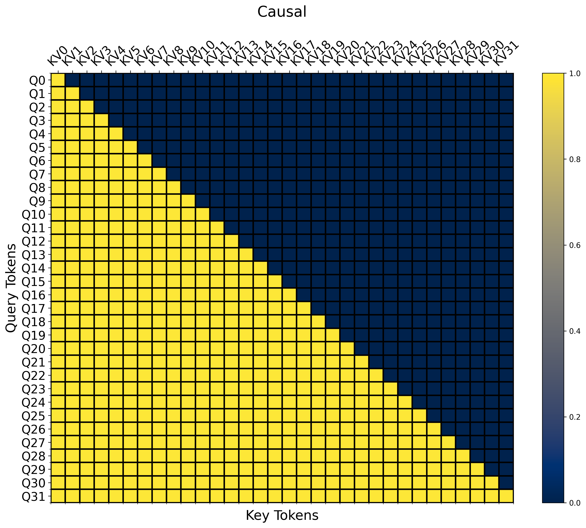
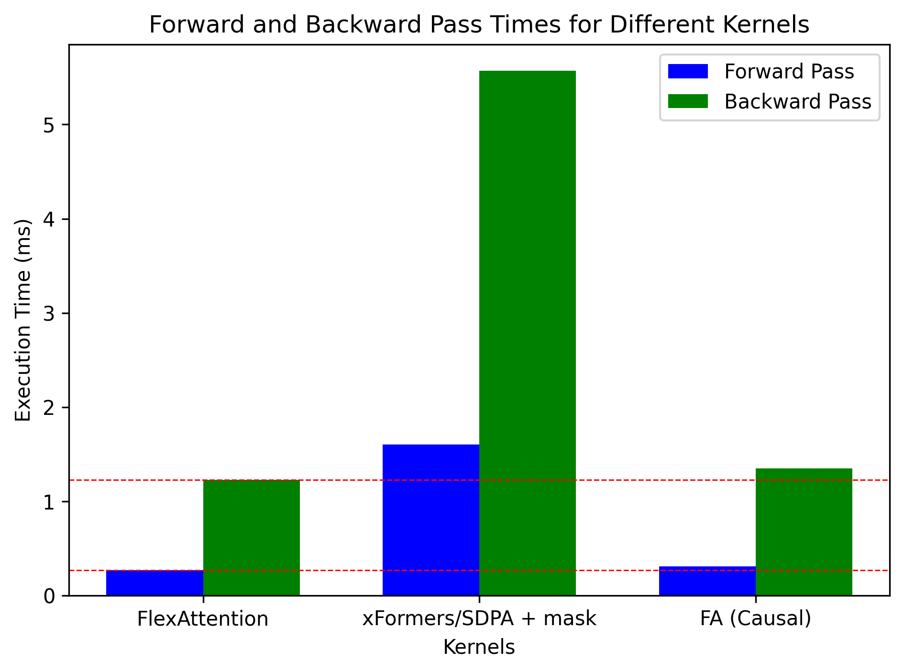
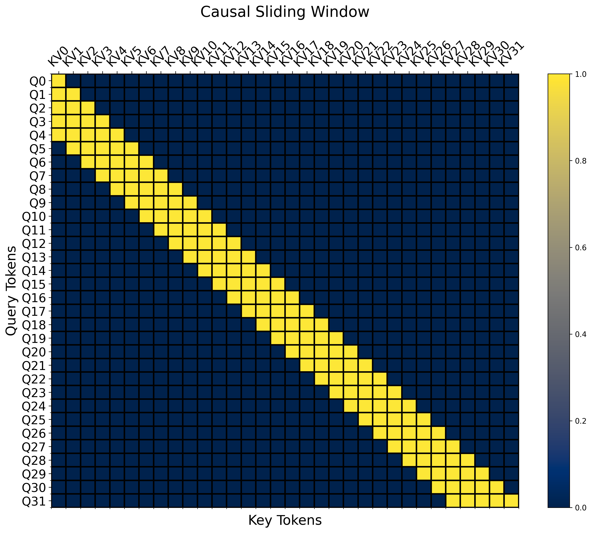
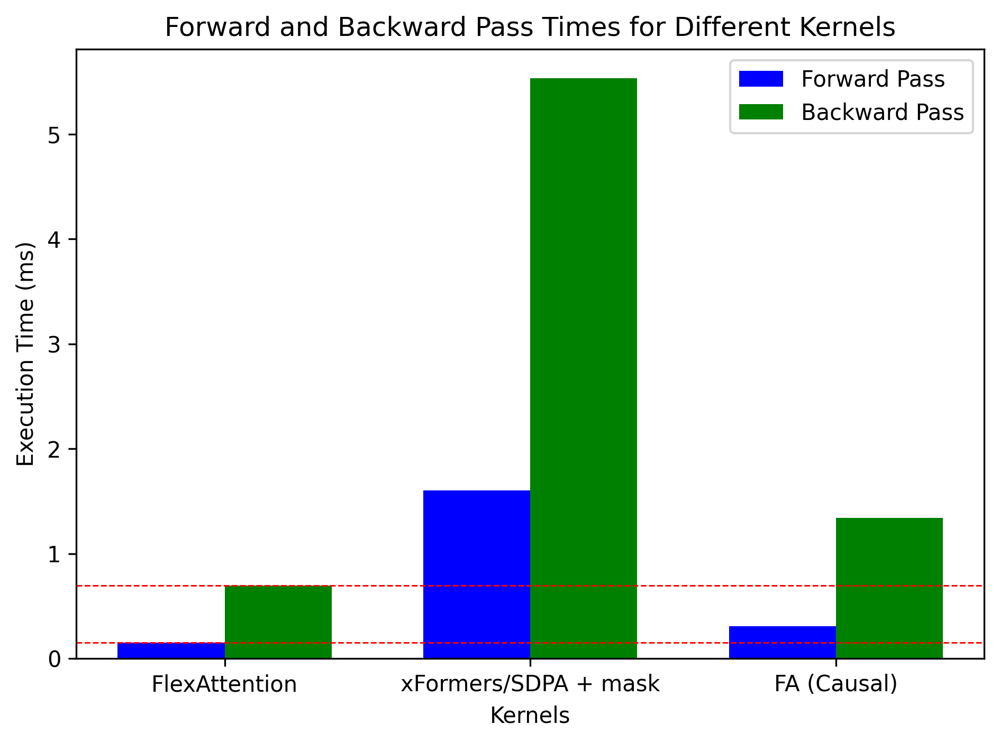
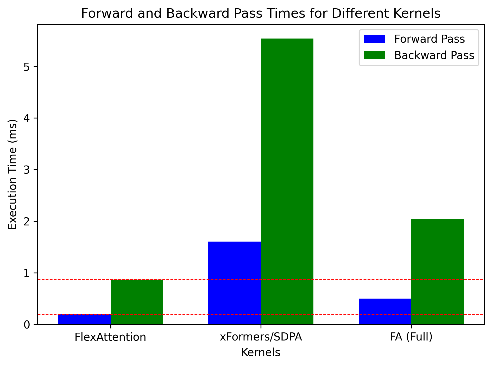
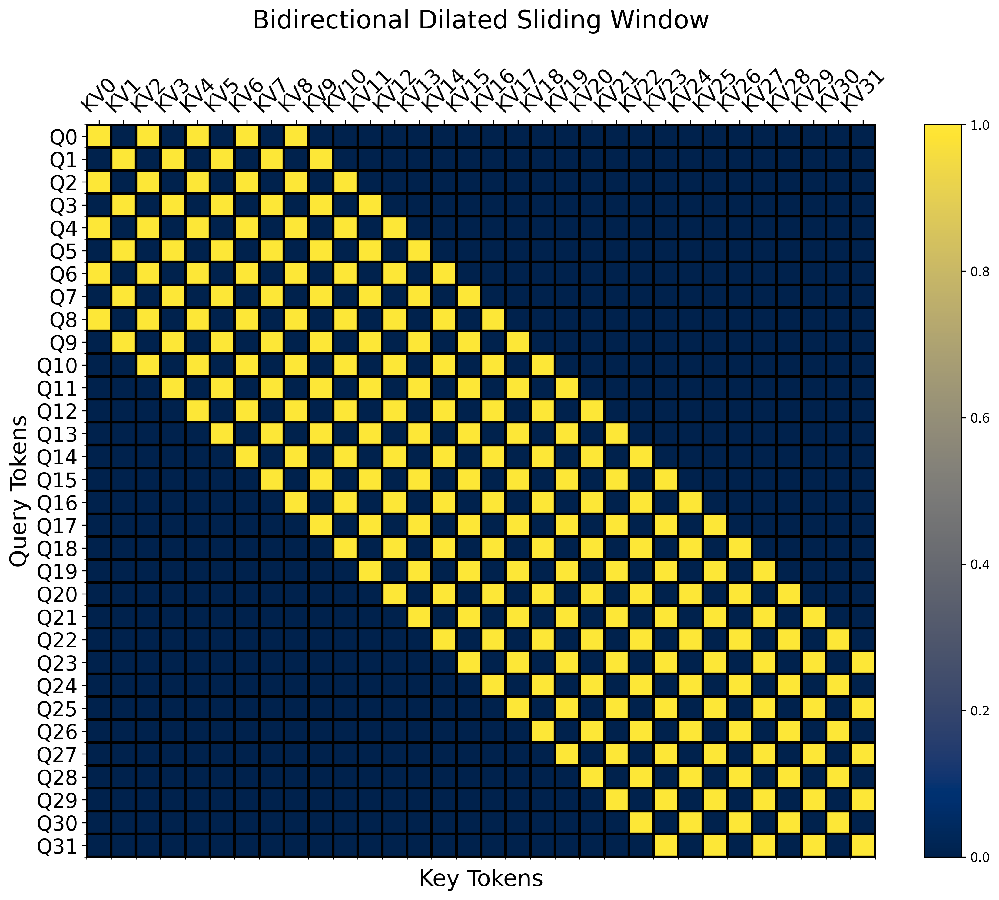
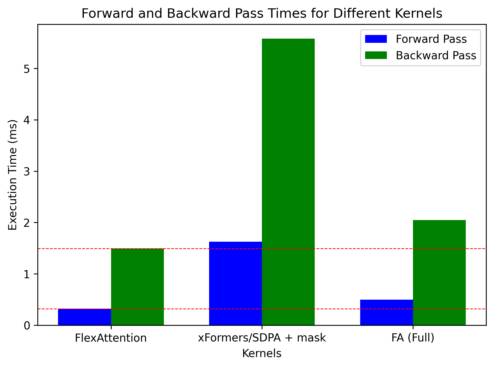
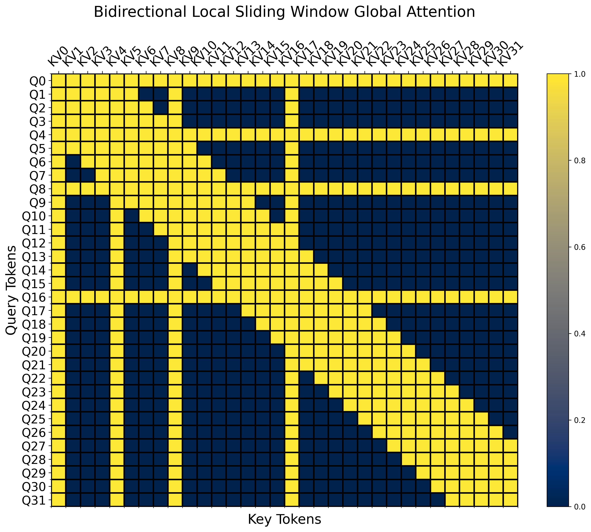
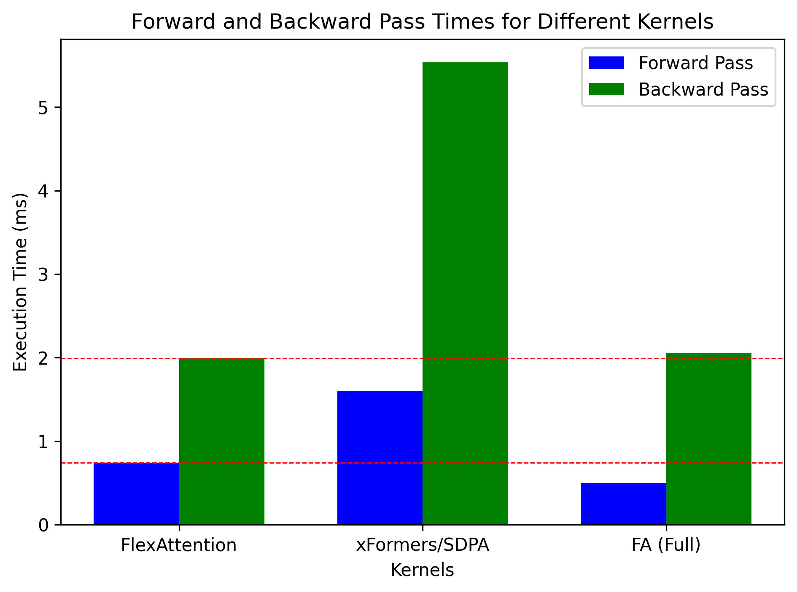

# Attention Mask Patterns

Using FlexAttention to compute attention with different masking patterns. 

The speedup over F.sdpa/xFormers and FA2 tends to increase with increasing sequence length. Timing plots are show for `seq_length=4096`.

### Causal mask
Mask             |  Exeecution Time
:-------------------------:|:-------------------------:
  |  

### Causal sliding window mask
Mask             |  Exeecution Time
:-------------------------:|:-------------------------:
  |  

### Bidirectional sliding window mask
Mask             |  Exeecution Time
:-------------------------:|:-------------------------:
  |  

### Bidirectional dilated sliding window mask
Mask             |  Exeecution Time
:-------------------------:|:-------------------------:
  |  

### Bidirectional global + local sliding window attention mask
Mask             |  Exeecution Time
:-------------------------:|:-------------------------:
  |  

## Requirements
* Pytorch Nightly (for FlexAttention, to be released with Pytorch 2.5)
* Refer `requirements.txt` for other requirements