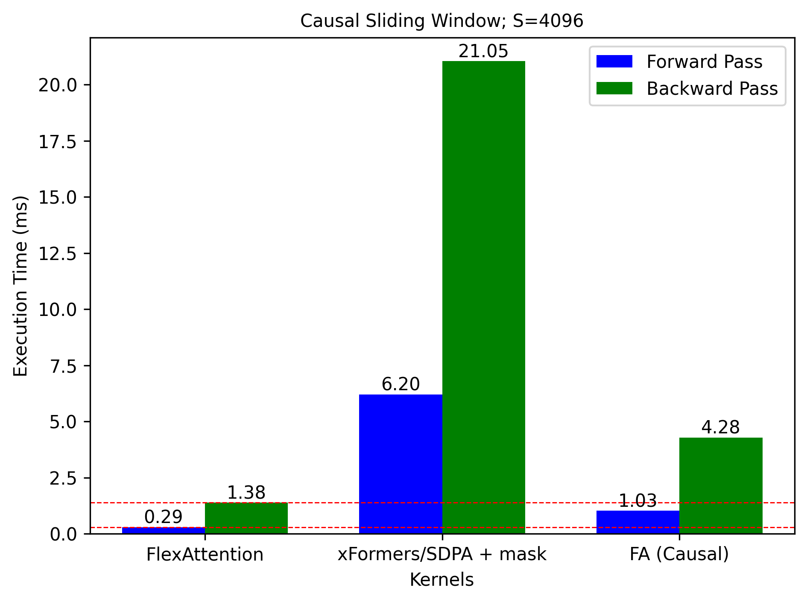
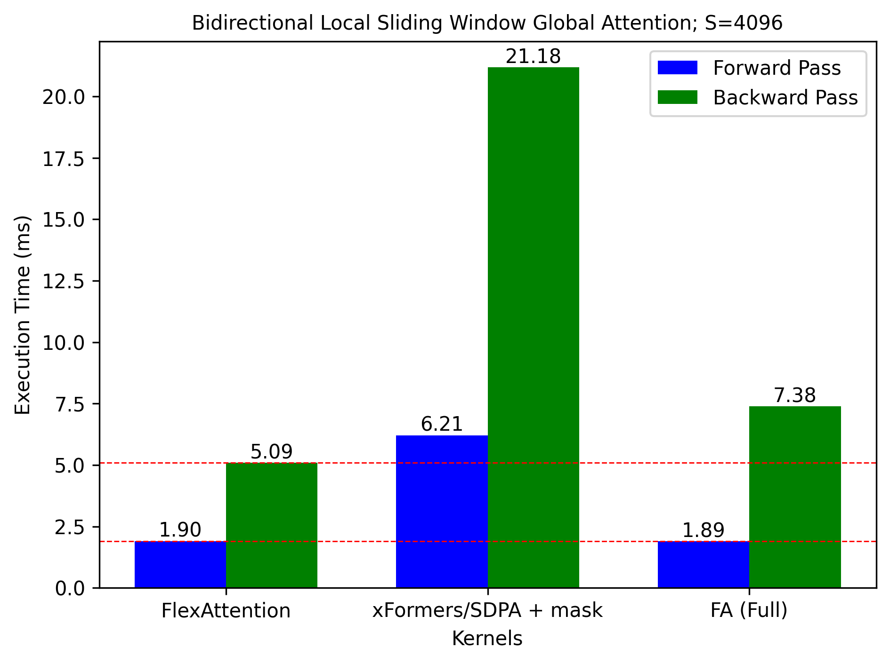

# Attention Mask Patterns

Using FlexAttention to compute attention with different masking patterns. 

The speedup over F.sdpa/xFormers and FA2 tends to increase with increasing sequence length. Timing plots are shown for different sequence lengths. It is mentioned in the title of the plot.

### Causal mask
Mask             |  Execution Time
:-------------------------:|:-------------------------:
  |  

### Causal sliding window mask
Mask             |  Execution Time
:-------------------------:|:-------------------------:
  |  

### Bidirectional sliding window mask
Mask             |  Execution Time
:-------------------------:|:-------------------------:
  |  

### Bidirectional dilated sliding window mask
Mask             |  Execution Time
:-------------------------:|:-------------------------:
  |  

### Bidirectional global + local sliding window attention mask
Mask             |  Execution Time
:-------------------------:|:-------------------------:
  |  

### PrefixLM mask
Mask             |  Execution Time
:-------------------------:|:-------------------------:
  |  

### Multi-document bidirectional mask
Mask             |  Execution Time
:-------------------------:|:-------------------------:
  |  

### Multi-document causal mask
Mask             |  Execution Time
:-------------------------:|:-------------------------:
  |  

### Multi-document prefixLM mask
Mask             |  Execution Time
:-------------------------:|:-------------------------:
  |  

### Stand-alone Self-Attention mask
(Reference - [attention-gym repo](https://github.com/pytorch-labs/attention-gym/blob/75867424a1d4391bff49527029d3612a09dd67e2/examples/flex_attn.ipynb))
Mask             |  Execution Time
:-------------------------:|:-------------------------:
  |  

## Requirements
* Pytorch Nightly (for FlexAttention, to be released with Pytorch 2.5)
* Refer `requirements.txt` for other requirements